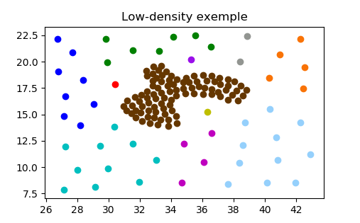
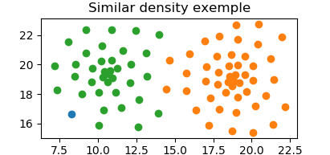
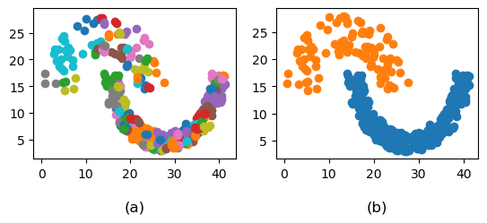
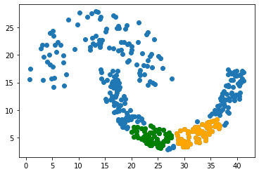
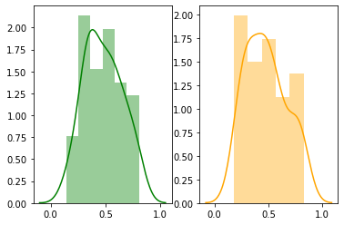

# DECWA
 DECWA (**DE**nsity-based **C**lusteringusing **WA**sserstein distance) is a hybrid clustering algorithm combining density and probabilistic approaches. It can handle several difficulties in datasets such as low-density clusters, near clusters of similar densities, and high-dimensional data. This is possible due to the probabilistic representation of clusters density and the use of the Wasserstein metric which is a distance function defined between probability distributions.
 
 ## Relevant publication
 DECWA implements an algorithm introduced in the following [paper](https://dl.acm.org/doi/10.1145/3340531.3412125 "DECWA : Density-Based Clustering using Wasserstein Distance"):
 ```
 DECWA : Density-Based Clustering using Wasserstein Distance
 Nabil El Malki, Robin Cugny, Olivier Teste, Franck Ravat
 CIKM 2020
 ```
 
 ## Implementation
 By now, the algorithm is functional, however, it is still a prototype in python. Therefore, a C implementation is studied in order to offer great efficiency.
 
 ## Results of DECWA
 Unlike most density-based clustering algorithm, DECWA does not focus on high-density points, it aims to find areas of homogeneous density, therefore, it is able to find low-density clusters.
 
 
 
 Here the selected parameters allow DECWA to discover hidden clusters in low-density regions. Most density-based approaches tend to find only one cluster here. They are focusing on the high-density points and do not consider the dots gravitating around as potential clusters. These points are often treated as outliers or are absorbed by the dense cluster. However, we believe that some crucial pieces of information are not always highly represented in a dataset. That is why, DECWA has been conceived to discover scarce classes.
 
 By focusing on density variation, DECWA is able to separate near clusters of similar densities. That is possible thanks to Wasserstein distance which is able to capture small differences between probability distributions.
 
 
 
 That leads DECWA to better clustering results in term of *ARI*, especially on real datasets where it is able to separate overlapping clusters if they have different densities.
 
 

Here on Iris dataset, the classes are close to each other (even when considering the 4 dimensions). However, DECWA is able to separate the clusters with a fine precision of **0.93** in terms of *ARI* score.
 
 ## Steps of DECWA
1. The first step transforms the dataset *X* into a *k*-nearest neighbor graph representation.
2. The second step consists in estimating the probability density of *X* from the weights of graph. 
3. The third step consists of extracting sub-clusters from the graph using probability density. (Division)
4. The fourth step is to agglomerate sub-clusters according to spatial distance and Wasserstein distance. (Fusion)

In the image below, DECWA first divides the dataset into homogeneous sub-clusters then merges the sub-clusters according to spatial distance and Wasserstein distance.


 
In the fusion process, Wasserstein distance has a major role, it ensure that sub-clusters are similar in their structure.
In the figure bellow, the distances between the probability distributions of two sub-clusters are calculated to verify if the samples are from the same law of probability.
 

 


Here the numerical value of Wasserstein distance is equal to **0.0248**. Therefore, depending on user needs, this may lead or not to the fusion of the concerned dataset. This can be adjusted by setting a threshold. Here, according to the ground truth, a correct threshold value for the whole dataset is **2**.

The table below gives the best parameters we obtained using random search on each dataset. This parameters allow to find the results presented in the paper.

| Dataset          |     ⍺ |   λ   |  h    | k  |  distance  |
| :------------    | :---: | :---: | :---: |:--:| ---------: |
| jain             | 2.25  |  2.18 |  8.83 | 6  |  euclidean |
| cluto-t7.10k     | 23.34 |  5.57 |  0.20 | 35 |  euclidean |
| compound         |  0.73 |  2.39 |  1.78 |  3 |  euclidean |
| pathbased        |  0.72 |  1.94 |  0.75 |  7 |  euclidean |
| iris             |  0.77 |  0.61 |  0.10 | 12 |  cityblock |
| cardiotocography |  2.90 |  2.18 |  0.85 |  3 |   canberra |
| plant            | 0.000005 | 0.002 | 0.001 | 40 |  euclidean |
| GCM              | 0.058 | 0.294 | 0.045 |  2 | braycurtis |
| News             |  0.45 |  0.41 |  0.49 | 29 |     cosine |
| Kidney_Uter      |  0.04 |  0.30 |  0.00 |  9 | braycurtis |
