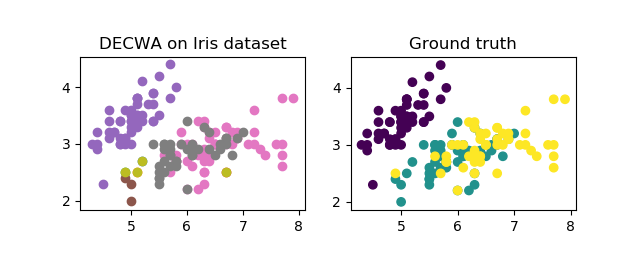
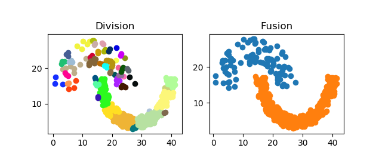

# DECWA
 DECWA (**DE**nsity-based **C**lusteringusing **WA**sserstein distance) is a hybrid clustering algorithm combining density and probabilistic approaches. It can handle several difficulties in datasets such as low-density clusters, near clusters of similar densities, and high-dimensional data. This is possible due to the probabilistic representation of clusters density and the use of the Wasserstein metric which is a distance function defined between probability distributions.
 
 ## Relevant publication
 DECWA implements an algorithm introduced in the following [paper](url_du_lien "DECWA : Density-Based Clustering using Wasserstein Distance"):
 ```
 DECWA : Density-Based Clustering using Wasserstein Distance
 Nabil El Malki, Robin Cugny, Olivier Teste, Franck Ravat
 CIKM 2020
 ```
 
 ## Results of DECWA
 Unlike most density-based clustering algorithm, DECWA does not focus on high-density points, it aims to find areas of homogeneous density, therefore, it is able to find low-density clusters. 
 
 
 
 Here, with correctly selected parameters, DECWA is able to discover nested clusters on the top left corner. Most density-based approaches tend to find two or one cluster here (due to overlapping). They are neglecting density variation, therefore, they do not find the core clusters and they do not consider the dots gravitating around as potential clusters. 
 
 Moreover, for the right part of this dataset, the classic density-based approach will find only one cluster including all points in the same cluster or considering the less dense points as outliers. DECWA has a different strategy, it tries to find clusters in low-density points instead.
 
 That strategy leads DECWA to better results in terms of *ARI*, especially on real datasets where it is able to separate overlapping clusters if they have different densities.
 
 

Here on Iris dataset, the classes are close to each other (even when considering the 4 dimensions). However, DECWA is able to separate the clusters with a fine precision of **0.93** in terms of *ARI* score.
 
 ## Understanding DECWA
 DECWA first divides the dataset into homogeneous sub-clusters. Then merges the sub-clusters that actually belong to the same clusters according to rules detailed in the [paper](url_du_lien "DECWA : Density-Based Clustering using Wasserstein Distance").
 
 
 
 Comparison of the division result (a) with fusion result (b) for jain dataset.
 
 
